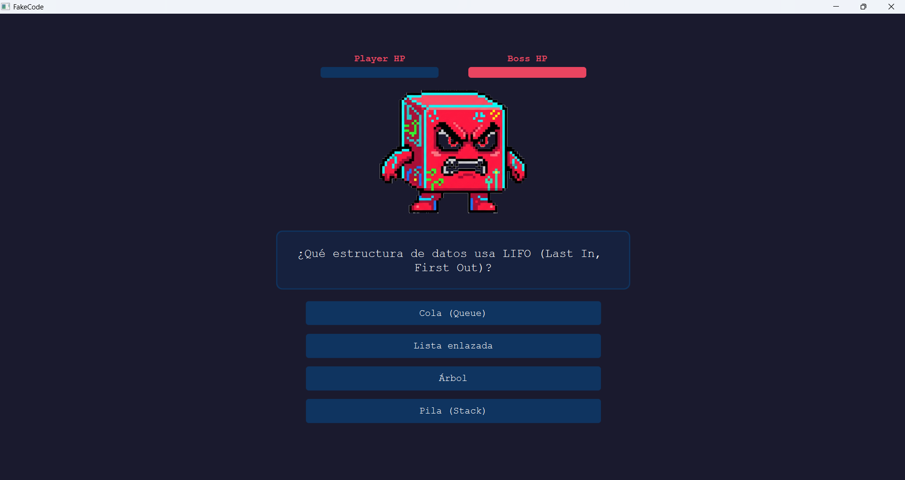
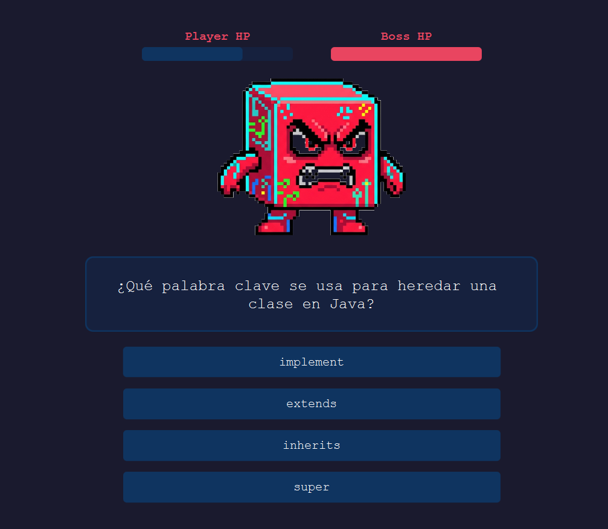
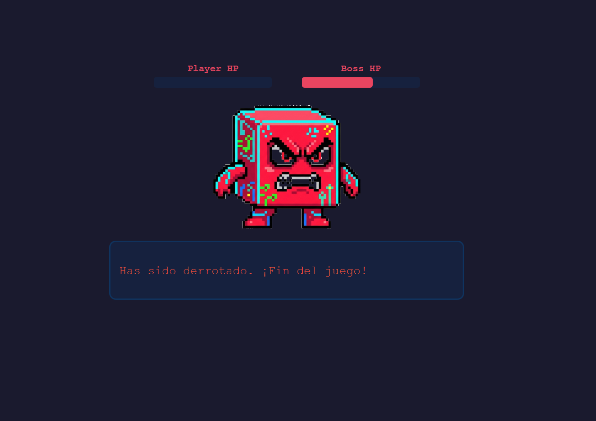

# 🎮 Fake Code

Fake Code es un videojuego desarrollado como proyecto académico, cuyo propósito es aplicar los conocimientos adquiridos en programación orientada a objetos mediante el uso del lenguaje Java y el desarrollo de una interfaz gráfica de usuario.

## 📋 Requisitos del Sistema

Para poder ejecutar este juego, tu equipo debe cumplir con el siguiente requisito mínimo:
* **Java Runtime Environment (JRE)** instalado (Versión 8 o superior recomendada).

> **Nota:** Puedes comprobar si tienes Java instalado abriendo tu consola de comandos y escribiendo `java -version`. Si no lo tienes, puedes descargarlo de forma gratuita desde [java.com](https://www.java.com/).

## 🚀 Cómo Ejecutar el Juego

El juego no requiere instalación. Solo necesitas el archivo principal compilado: `Fake_Code.jar`. 

Elige uno de los siguientes métodos para jugar:

### Método 1: Ejecución rápida
1. Descarga la carpeta **Fake Code** en tu equipo o dispositivo.
2. Ingresa a la carpeta `Fake Code`, luego a la carpeta `demo`.
3. Ingresa a la carpeta `target`. Posteriormente vas a encontrar el archivo `Fake_Code.jar`, haz doble clic en el archivo y podrás acceder al juego.

## 🕹️ Controles del Juego
* **[Mouse]:** Clic en la respuesta para avanzar a la siguiente pregunta.
* **[Menú]:** Minimizar / Maximizar / Salir.

## 🎲 Dinámica del juego

1. **Pantalla Principal:** Al iniciar, verás el menú principal. Responde la primera pregunta para comenzar.
   
   

2. **Resolución de preguntas:** Lee detenidamente la pregunta de código. Haz clic sobre la opción correcta para avanzar al siguiente nivel.
   
   

3. **Fin del juego:** Si respondes incorrectamente, el juego terminará y deberás iniciar nuevamente.

   

## 🛠️ Tecnologías Utilizadas
* **Lenguaje:** Java
* **Desarrollo y Herramientas:** JavaFX, Maven, CSS, JUnit, Javadoc

## 👨‍💻 Autores 
* Adrian Felipe Aguilar
* Cristian Andrés Alarcón
* Diego Marino Acevedo
* Juan José Arcila
* Mateo Acevedo Benjumea

---
¡Gracias por jugar Fake Code! Si encuentras algún error o tienes una sugerencia, no dudes en reportarlo.
